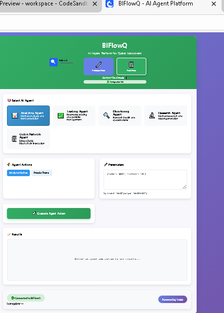
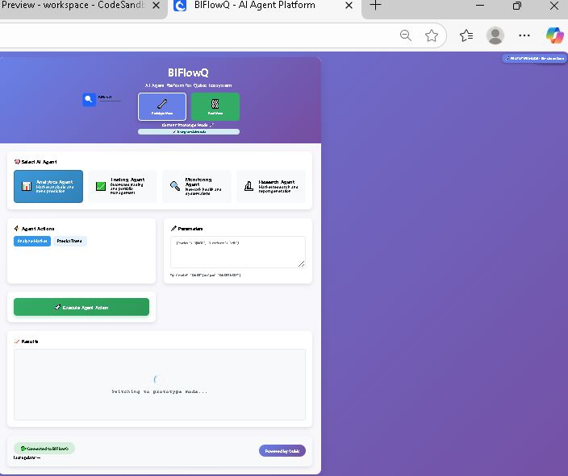

markdown
# 🚀 BIFlowQ – AI Agent Platform for Qubic

<div align="center">


**Revolutionizing Decentralized AI Computation on the Qubic Network**

🔗 **Live Demo**: [https://8x425h-3000.csb.app/](https://8x425h-3000.csb.app/)

</div>

## 🖼️ UI Preview

<div align="center">


</div>

## 🌟 Overview

BIFlowQ is a multi-agent AI platform built on top of the Qubic decentralized network, combining:

- **Multi-agent artificial intelligence**
- **Real blockchain interaction** 
- **Automated market analysis**
- **Trading simulation**
- **Research, monitoring, and intelligence**
- **Real-time frontend interface**
- **Dual execution mode (Prototype + Real Mode)**

Designed for the Qubic Hack The Future hackathon, BIFlowQ demonstrates how AI can operate in a decentralized computation network.

## ✨ Key Features

### 🤖 Multi-Agent AI System

A fully modular system with 5 intelligent agents:

| Agent | Icon | Description | Key Actions |
|-------|------|-------------|-------------|
| Analytics | 📊 | Market analysis & trend prediction | `analyze-market`, `predict-trend` |
| Trading | 💹 | Automated trades & portfolio management | `execute-trade`, `get-portfolio` |
| Monitoring | 🔍 | Network health checks & alerts | `monitor-network`, `alert-system` |
| Research | 🔬 | Market research and intelligence reports | `research-topic`, `generate-report` |
| Qubic Network | ⛓️ | Direct blockchain operations | `get-network-stats`, `submit-ai-task` |

### 🔧 Dual Mode Operation

#### 🧩 Prototype Mode (default)
- No blockchain connection
- Fast simulated data
- Ideal for demos & development

**Run:**
```bash
npm start
🔥 Real Mode (true Qubic network)
Real-time blockchain data

Smart-contract interaction

Real market feeds

Setup:

bash
npm run setup:real
npm run generate:wallet
npm run start:real
📡 Agent Usage Examples
📊 Market Analysis
json
{
  "agentType": "analytics",
  "action": "analyze-market",
  "parameters": {
    "market": "QUBIC",
    "timeframe": "24h"
  }
}
💹 Execute Trade
json
{
  "agentType": "trading", 
  "action": "execute-trade",
  "parameters": {
    "pair": "QUBIC/USDT",
    "side": "BUY",
    "amount": 1
  }
}
🏗️ Architecture
text
┌────────────────────┐   ◄───►   ┌──────────────────────┐   ◄───►   ┌─────────────────────────┐
│      Frontend       │           │      Backend API      │           │      Qubic Network       │
│   (Vanilla JS UI)   │           │      (Express.js)     │           │ (Blockchain + Smart SC)  │
└────────────────────┘           └──────────────────────┘           └─────────────────────────┘
                     │
                     │
                     ▼
        ┌────────────────────────────────────────────────────────┐
        │                         AI Agents                       │
        │ Analytics | Trading | Monitoring | Research | Qubic Net │
        └────────────────────────────────────────────────────────┘
⚙️ Installation
Prerequisites
Node.js v18+

npm or yarn

Install & Run
bash
git clone https://github.com/BCBLearning/BIFlowQ.git
cd BIFlowQ
npm install
npm start
📥 Environment Configuration
Create a .env file:

env
REAL_QUBIC=false
QUBIC_NETWORK=testnet
QUBIC_PRIVATE_KEY=your_private_key_here
QUBIC_CONTRACT_ADDRESS=0xYourDeployedContract
COINGECKO_API_KEY=your_api_key
PORT=3000
NODE_ENV=development
📡 API Documentation
REST Endpoints
Endpoint	Method	Description
/api/health	GET	Server health check
/api/mode	GET	Read current mode
/api/mode	POST	Switch mode
🔌 WebSocket Events
Event	Direction	Description
config-update	Server → Client	New config pushed
agent-request	Client → Server	Trigger agent
agent-response	Server → Client	Agent result
mode-changed	Server → Client	Mode switch notice
🛠️ Technology Stack
Backend
Node.js

Express.js

Socket.io

Axios

Ethers.js

Frontend
HTML / CSS

Vanilla JavaScript

Socket.io client

Blockchain
Qubic Network

Smart contracts

Decentralized AI tasks

👥 Team
Role	Name	Contributions
Lead Developer	BesmaInfo	Architecture, Fullstack dev, AI agents
AI Specialist	BesmaInfo	Analytics engine, trading logic
📬 Contact
📧 Email: besmainfo2025@gmail.com

🌐 GitHub: https://github.com/BCBLearning

📦 Repository: https://github.com/BCBLearning/BIFlowQ

🤝 Contributing
bash
git clone https://github.com/BCBLearning/BIFlowQ.git
cd BIFlowQ
npm install
npm run dev
📄 License
MIT License – see the LICENSE file.

<div align="center">
🏆 Hackathon Submission
Built with ❤️ for the Qubic Hack The Future Hackathon

🔗 Live Demo → https://8x425h-3000.csb.app/

Revolutionizing decentralized AI computation, one agent at a time.

</div> ```
